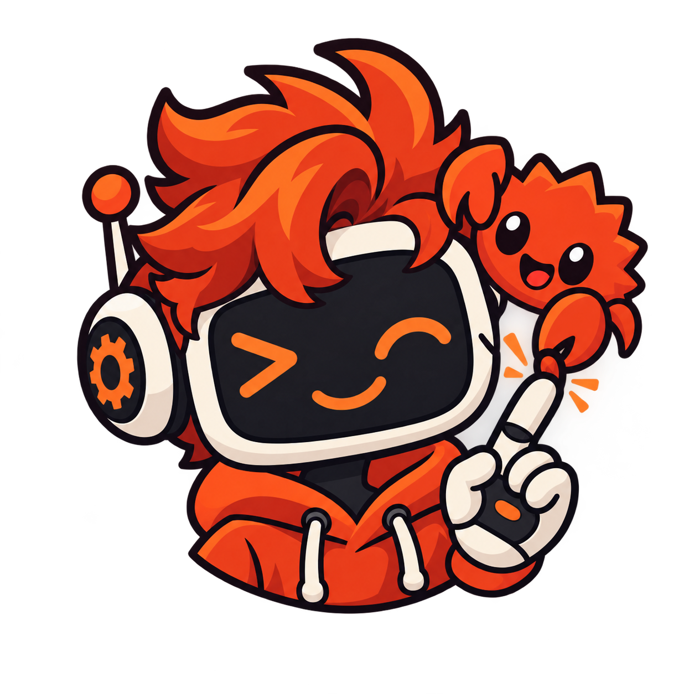

<p align="center">
  
</p>

<h1 align="center">Ruji</h1>

<p align="center">
  <strong>Cherche un emoji ou une icône par ce qu'il <em>veut dire</em>, pas par son nom.</strong>
  <br />
  <code>Ctrl+Shift+E</code> · tape « content » · récupère 😀 · collé où était ton curseur.
</p>

<p align="center">
  
  
  
</p>

<p align="center">
  
</p>

## C'est quoi ?

Une capsule flottante, invoquée d'un raccourci clavier, qui comprend le **sens** de ce que tu tapes plutôt qu'un simple mot-clé exact. Tape « ordinateur en panne », « content », « python » ou « connexion internet » — Ruji trouve le bon emoji ou la bonne icône, même si le mot exact n'apparaît nulle part dans sa base.

Tout tourne en local. Aucune donnée n'est envoyée où que ce soit — le modèle de recherche sémantique (~3 Mo, distillé, ONNX) s'exécute entièrement sur ta machine.

## Fonctionnalités

- 🔍 **Recherche par sens** — FR/EN, modèle de similarité sémantique embarqué
- ⌨️ **Ctrl+Shift+E** partout — navigateur, IDE, terminal, éditeur de texte...
- 🖱️ Capsule qui suit le curseur, se fige dès que tu tapes
- 📋 Collage direct dans l'appli active (clipboard + injection clavier), fonctionne même dans un terminal
- 🎨 Thème clair / sombre, bascule des icônes Nerd Font
- 🐧 🪟 **Linux** (GNOME/X11/Wayland) et **Windows**

## Installation

### Linux

```bash
git clone https://github.com/mr-context/ruji.git
cd ruji
cargo build --release
./target/release/ruji
```

Au premier lancement, Ruji installe automatiquement son raccourci clavier GNOME et te guide pour les permissions nécessaires (groupe `input` pour le collage universel, extension GNOME Shell pour le suivi de curseur précis).

### Windows

Récupère `RujiSetup.exe` depuis les [Releases](../../releases), ou compile toi-même par cross-compilation depuis Linux :

```bash
rustup target add x86_64-pc-windows-msvc
cargo install cargo-xwin
cargo xwin build --release --target x86_64-pc-windows-msvc
```

## Comment ça marche

Un petit modèle MiniLM distillé (2 couches, 384 dimensions, quantifié INT8) encode ta recherche et la compare par similarité cosinus à ~400 concepts pré-encodés (emoji + icônes [Nerd Font](https://www.nerdfonts.com/)). Un seuil adaptatif filtre les résultats hors-sujet plutôt que de toujours en afficher un nombre fixe.

Voir [`iconpicker_llm`](https://github.com/mr-context/iconpicker_llm) pour le pipeline d'entraînement du modèle.

## Soutenir le projet

Si Ruji te sert au quotidien, tu peux soutenir son développement via [GitHub Sponsors](https://github.com/sponsors/mr-context). Aucune obligation — le projet reste gratuit et open source.

## Licence

MIT
